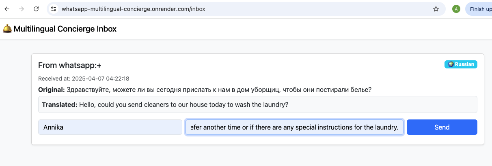
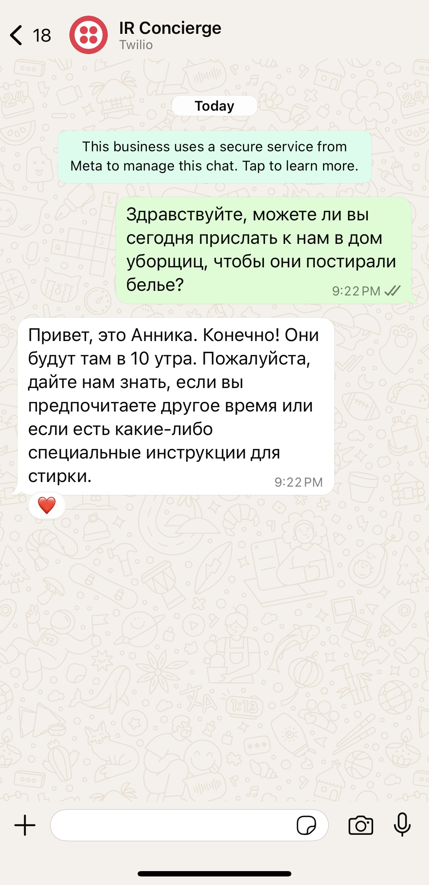

# Quick and Dirty: WhatsApp Concierge Translator

A real-time, AI-powered multilingual assistant built for luxury travel and hospitality teams — using OpenAI, Twilio, and Flask to translate guest WhatsApp messages without disrupting the high-touch human experience.

---

## Why This Exists

Luxury concierge and travel management teams often serve international guests who prefer communicating over WhatsApp.

When guests message in languages like Russian, Mandarin, or Spanish, staff either:
- Scramble for translation tools
- Use clunky apps
- Or respond too slowly — which breaks the experience in an environment where speed, warmth, and discretion matter

---

## What This Tries to Solve

This prototype acts as a silent translator behind the scenes:

- Guests message a concierge on WhatsApp as usual
- The system detects the language and translates it to English
- Staff reply in English via a web inbox
- The message is automatically translated back into the guest’s original language and sent via WhatsApp

This keeps things fast and human. No bots, no extra apps for the guest, no need to switch platforms for the concierge team.

---

## Demo

Here’s what the staff dashboard looks like:



And here’s what the guest sees via WhatsApp:



---

## How It Works

1. A guest sends a WhatsApp message to a Twilio sandbox number
2. Twilio posts the message to a Flask server
3. The Flask app:
   - Detects the message language using OpenAI (GPT-4)
   - Translates the message to English if needed
   - Stores the message and detected language in memory
4. Staff log into a web dashboard to view incoming messages
5. They reply in English; the reply is auto-translated and sent back via Twilio

---

## Tech Stack

- Python + Flask
- OpenAI API (GPT-4)
- Twilio WhatsApp Sandbox
- Bootstrap (for the frontend)
- Render (for deployment)
- ngrok (for local testing)
- `.env` config via `python-dotenv`

---

## Getting Started (Local)

```bash
git clone https://github.com/YOUR_USERNAME/whatsapp-concierge-translator.git
cd whatsapp-concierge-translator
pip install -r requirements.txt
```

Then create a .env file with:
```bash
OPENAI_API_KEY=your_openai_key
TWILIO_ACCOUNT_SID=your_twilio_sid
TWILIO_AUTH_TOKEN=your_twilio_auth_token
TWILIO_PHONE_NUMBER=your_twilio_phone_number
```

Start the Flask app:

```bash
python app.py
```

Start ngrok (in a separate terminal):
```bash
ngrok http 5000
```
Update your Twilio sandbox webhook to point to https://<your-ngrok-url>/incoming.

---

## Why This Project Exists
This prototype was built to show how a small, resource-constrained team can use AI to solve real customer problems — fast.

The goal was to demonstrate that with OpenAI, Twilio, and a bit of product thinking, you can prototype a working tool in hours — not weeks — without sacrificing the human touch that defines a luxury experience.

This approach is:
* Lightweight enough to test without disrupting workflows
* Easy to tailor to team tone and guest expectations
* A starting point for deeper automation or custom AI integration later

It’s designed for teams who need translation, not transformation — and want to see what’s possible without a full rebuild.
